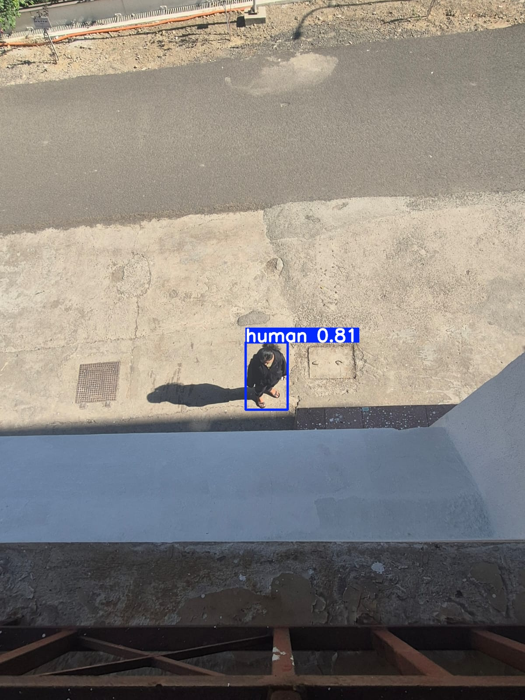
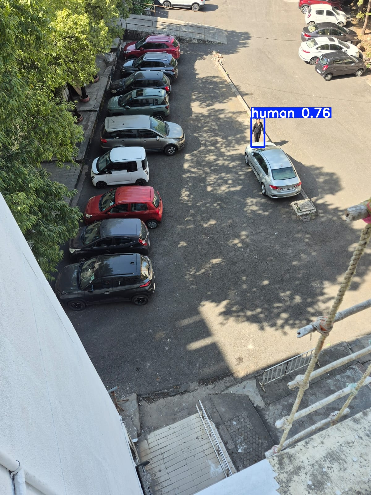

# 🚁 NIDAR: Aerial Survivor Detection (Edge AI)

Real-time aerial detection of flood survivors using YOLOv8n deployed on Raspberry Pi 5 with Sony IMX500 NPU. Achieved mAP@50 of 0.697 on filtered VisDrone2019 data, running inference on constrained edge hardware as part of the DFI NIDAR national challenge.

**Lead ML Engineer of my Team for the National Innovation Challenge for Drone Application and Research (NIDAR)**
This repository contains the end-to-end Machine Learning pipeline developed for the Drone Federation of India (DFI) National Challenge. The system is architected to detect stranded humans in flood-affected regions using high-resolution aerial vision and real-time edge inference.

---

## 🛠️ Technical Stack

- **Model Architecture:** YOLOv8n (Ultralytics)  
- **Inference Engine:** PyTorch & OpenCV  
- **Training Infrastructure:** Dual NVIDIA T4 GPUs | NVIDIA RTX 4090  
- **Edge Deployment:** Raspberry Pi 5 + Sony IMX500 AI Camera (NPU Accelerated)  
- **Dataset:** VisDrone2019-DET (10K+ images, 261K+ frames)

---

## 🏗️ System Architecture & Logic

### 1. Dataset Engineering & Sanitization

Aerial imagery presents unique challenges: small object scales and nadir (top-down) perspectives.

- **Class Filtering:** Developed custom scripts to isolate *Pedestrian* and *People* classes from the 10-class VisDrone set.  
- **Label Normalization:** Automated remapping of VisDrone `.txt` annotations to normalized YOLO format.  
- **Sanitization:** Scrubbed noisy labels (reflections/partial occlusions) to ensure high-fidelity training.  

---

### 2. High-Resolution Training (Kaggle T4)

Standard 640px models often fail to localize humans from altitudes >30m.

- **Resolution:** Trained at 1280px to maintain spatial features of distant survivors.  
- **Optimization:** 200-epoch training run with heavy augmentation (Mosaic, Mixup, Blur) to simulate storm conditions.  
- **Notebook:** View the full training logs and hyperparameter tuning in [notebook](training.ipynb).  

---

### 3. Edge Deployment (Raspberry Pi 5)

Moving from a 450W GPU to a 15W edge device required significant optimization.

- **Hardware Integration:** Integrated the Sony IMX500 AI Camera, offloading detection to the onboard NPU.  
- **Real-time Pipeline:** Built a custom OpenCV wrapper to handle the live 1280px stream with low-latency frame buffering.  

---

## 📊 Performance Metrics

| Metric     | Value |
|-----------|------|
| Precision | 0.767 |
| Recall    | 0.611 |
| mAP@50    | 0.697 |

> **Note:** Metrics were achieved under variable lighting and altitude conditions to ensure reliability in field rescue.

---

## 📁 Repository Structure

```plaintext
NIDAR_survivor_detection/
├── core/
│   ├── check_gpu.py                # CUDA Diagnostic tool
│   ├── extract.py                  # Dataset extraction utility
│   └── convert_visdrone_to_yolo.py # Custom VisDrone sanitization script
├── deployment/
│   ├── ai_camera.py                # Hardware/NPU verification script
│   └── final_working.py            # Main OpenCV + YOLO real-time inference loop
├── docs/
│   ├── detections/                 # test results ofor custom aerial feed
│   └── Results                     # Training graphs, loss curves and batch samples
├── training.ipynb                  # kaggle notebook containing training parameters and epochs
└── README.md
```

---

## 🚀 Getting Started

### 1. Environment Setup

```bash
conda create -n dronecv python=3.10 -y
conda activate dronecv
pip install ultralytics opencv-python torch torchvision
```

---

### 2. Dataset Preparation

Download the VisDrone Dataset.

Place ZIP files in `data/raw/` and run the sanitization pipeline:

```bash
python core/extract.py
python core/convert_visdrone_to_yolo.py
```

---

### 3. Model Training

Train the YOLOv8 model on the processed dataset:

```bash
yolo detect train \
  model=yolov8n.pt \
  data=data.yaml \
  imgsz=1280 \
  epochs=200 \
  batch=16 \
  name=nidar_yolov8
```

- **imgsz=1280** → preserves small object features from aerial height  
- **epochs=200** → ensures convergence on complex aerial data  
- **augmentations** (default + custom) simulate real-world flood conditions  

📓 **Notebook:** [View full training logs and experiments](training.ipynb)

---

## 📊 Results & Visualizations

### 📈 Training Metrics & Graphs

Explore loss curves, precision-recall trends, and evaluation metrics:

- [📊 View Training Metrics](docs/Results/metrics/)

---

### 🛰️ Detection Outputs (Custom Test Set)

Sample predictions on aerial flood scenarios:

- [🖼️ View Detection Results](docs/detections/custom_data/)

---

### 🔍 Sample Output

| Detections |
|------------|----------|
|  |
|  | 

> Bounding boxes indicate detected survivors with confidence scores.

---

### 4. Real-Time Inference (Edge Device)

Ensure your IMX500 drivers are configured on the Raspberry Pi 5, then run:

```bash
python deployment/final_working.py --model weights/best.pt
```

---

## ⚖️ Ethical Considerations & Impact

This project moves beyond "classic" CV tasks by addressing the ethical implications of dataset bias in search-and-rescue. By prioritizing high precision and testing across diverse aerial perspectives, this system aims to provide a reliable tool for first responders where every second counts.

---

## 🤝 Acknowledgments

Special thanks to the Drone Federation of India (DFI) for the opportunity to innovate for social good, and to my teammates who engineered the custom drone airframe that gave this vision system its wings.
